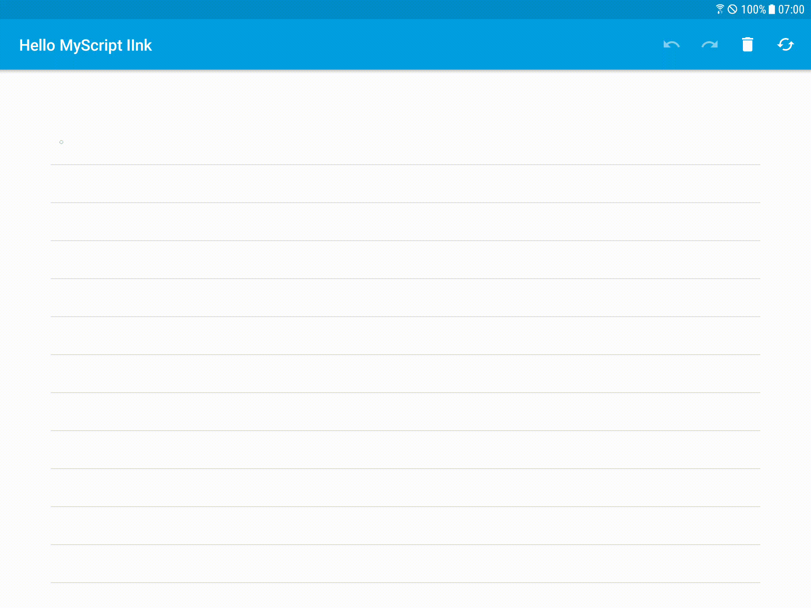
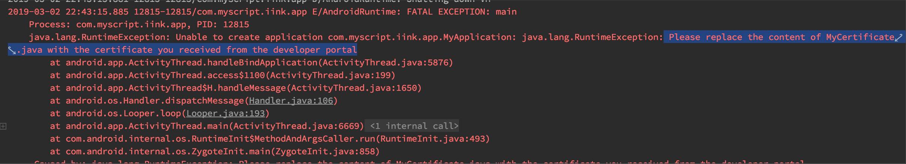
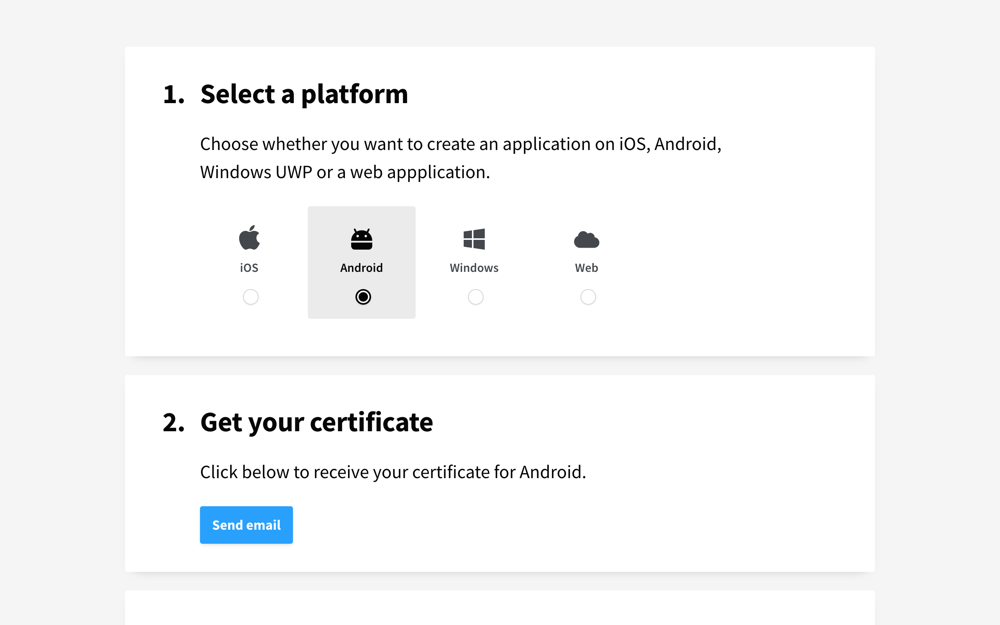
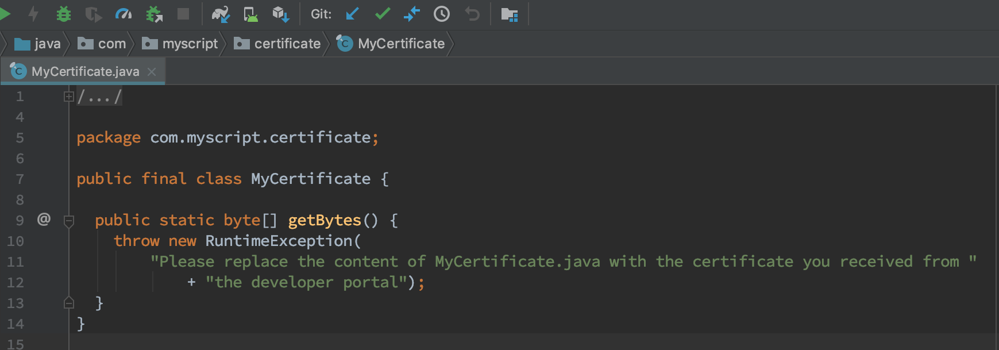

Welcome to Code Labs for MyScript Interactive Ink
=================================================

[MyScript Developer](https://developer.myscript.com/) provides a complete developer guide of programming with [Interacrive Ink SDK](https://developer.myscript.com/docs/interactive-ink/1.3/overview/about/), however, the Code Labs in this project are aimed at hands-on coding experience by stepping you throught the process of buiding a small application or integrating Interactive Ink into an existing application.

- [Welcome to Code Labs for MyScript Interactive Ink](#welcome-to-code-labs-for-myscript-interactive-ink)
  - [Code Labs](#code-labs)
  - [MyScript Certificate](#myscript-certificate)

Code Labs
---------

- [Get Started: Your First Interactive Ink Application](app/starter)
- [Math Pad: An Interative Ink Application for Handwriting Formulas](app/math-pad)
- [Sample: Create Multiple Editor Views](app/samples/editor-views)
- [Advance: MyScript Interactive Ink with Model-View-ViewModel](app/samples/iink-with-mvvm)

MyScript Certificate
--------------------

> [!IMPORTANT]
> A personal developer certificate applied from [MyScript Developer](https://developer.myscript.com/getting-started) is integrated for the samples in this project, and is **NOT** supposed to be transfered for other usages.

If you run the starter app or samples without a valid certificate, you'll see your application crashes and an error showing up in the `logcat` window:

> [!ERROR]
> Please replace the content of MyCertificate.java with the certificate you received from the [developer portal](https://developer.myscript.com/getting-started).

To make it work, you have to go to the [MyScript Developer](https://developer.myscript.com/getting-started) website, select the plarform `Android`, then click `send email` under `Get your certificate` to receive a valid certificate:

Then replace the certificate `MyCertificate.java` by the one you receive from [MyScript Developer](https://developer.myscript.com/getting-started) in the `myscript-certificate` module:

Then rebuild and run your app, the error should no longer show up.

> [!ATTENTION]
> This project starts from a personal [scaffold (Kotlin)](https://github.com/jingkecn/myscript-iink-scaffold-android-kotlin) for MyScript interactive ink SDK. For your better comprehensions, make sure that you practice as well with the [scaffold (Kotlin)](https://github.com/jingkecn/myscript-iink-scaffold-android-kotlin) to start from the same scratch line.
>
> [!DISCLAIMER]
> This is not an official project of MyScript Interactive Ink, and is **ONLY** for learning exchange purposes, and is **NOT** supposed to have quality guarantee and supports.
