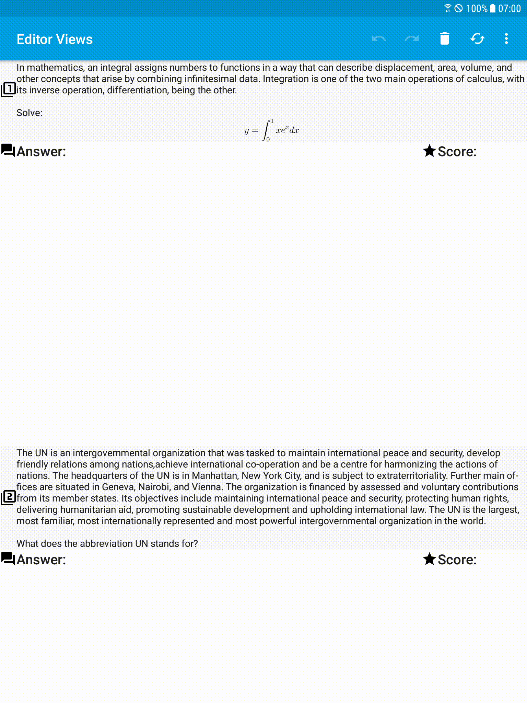
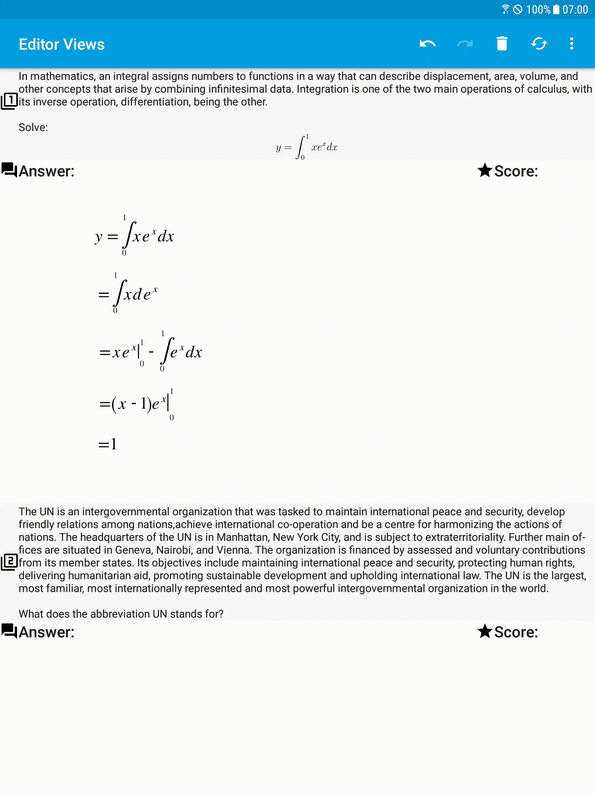
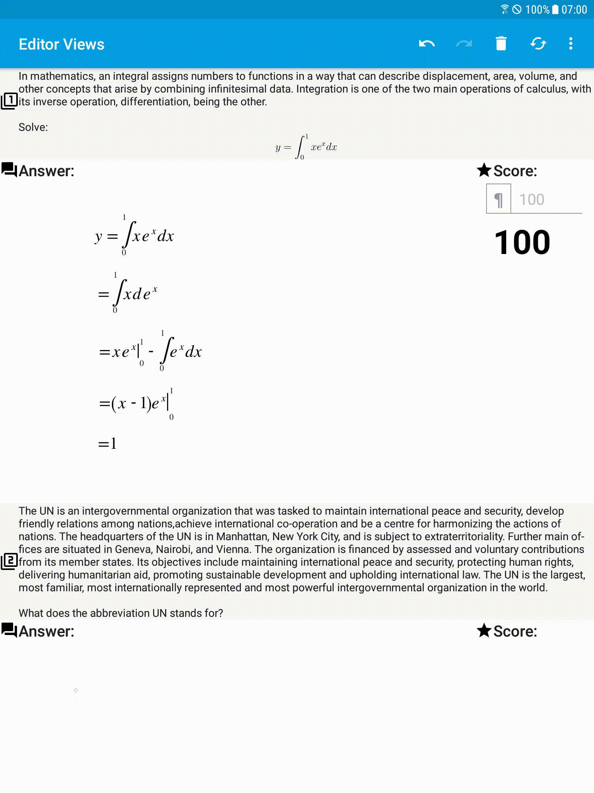

Sample: Create Multiple Editor Views
====================================

| Excercise | Answer                                                                                  | Score                                                                                 |
| --------- | --------------------------------------------------------------------------------------- | ------------------------------------------------------------------------------------- |
| 1         |  |  |
| 2         |  |  |
